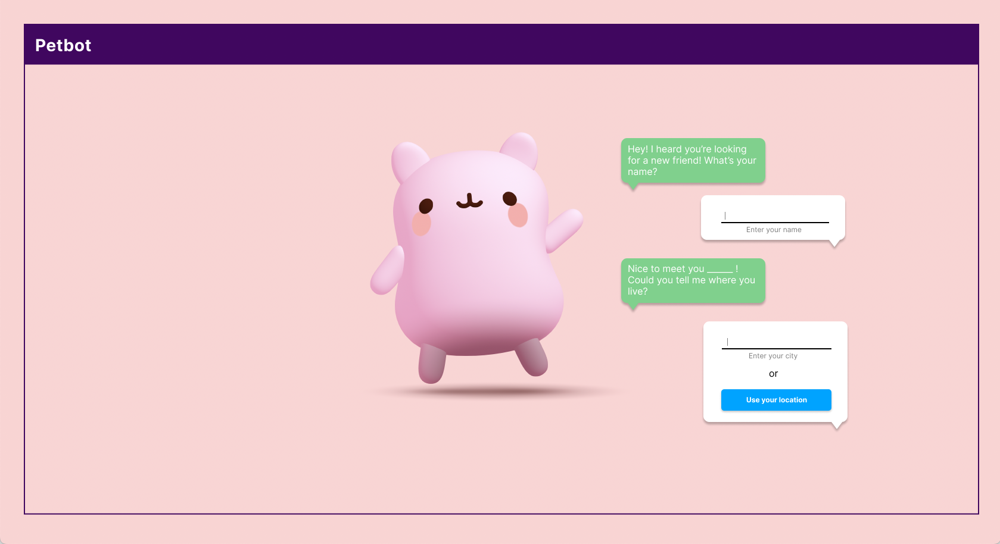
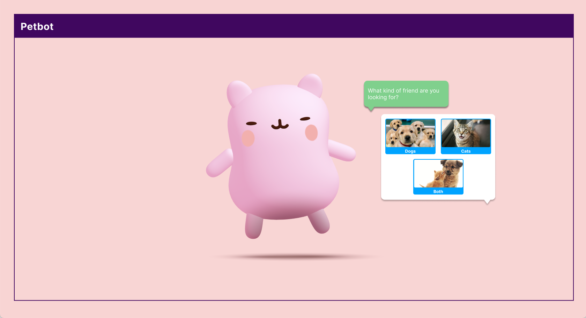
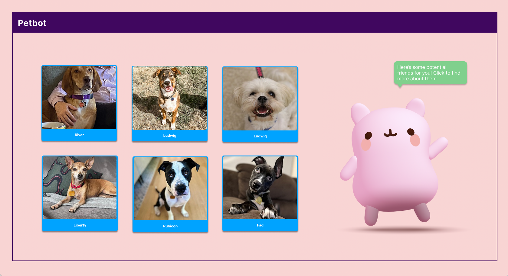

# Connections Lab - Project 1, "Petbot"
### Dora Do, NYU IMA Fall '22

A chatbot that that helps you find adoptable pets in your area. The dataset will be called from the Adopt-a-pet’s (or alternative) API. Spline is used to create 3D visuals that will go with the chatbot. The idea is to make chatbots feel more personal when it’s attached to a character.

